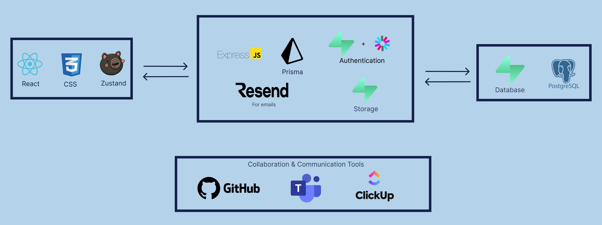

# Referra – Referral Web App to Ease the Hiring Process
Referra is a web application designed to simplify and streamline the employee referral process for companies. Employees can submit referrals for open positions, track their referral status, and potentially earn compensation. HR teams can manage positions, review referrals, and track candidates’ progress in a centralized dashboard.

---

## Table of Contents 

- [Features](#features)
- [Technologies](#technologies)
- [Installation full setup](#installation)
- [Usage](#usage)

---

## Features

- Role-Based Authentication: Employee and HR roles with Supabase authentication.
- Employee Referral Submission: Submit new candidates with auto-fill for existing ones.
- Referral Tracking: Monitor referral status through interviews, acceptance, and hiring.
- HR Dashboard: View and manage referrals, positions, and team members.
- Email Notifications: Automated email notifications using resend.
- Position Management: HR can create, open/close, and manage positions in their departments.
- Compensation Tracking: Employees can receive compensation for successfully hired referrals.
- Secure Backend: Built with Express.js and Prisma ORM.
- Database: PostgreSQL (Supabase) for reliable and scalable data storage.
- Deployment: Frontend deployed on Vercel and backend deployed on Render.

---

## Technologies



--- 

## Installation

#### 1. Clone the Repository
   
```bash
git clone https://github.com/alahmad-loay2/referra.git
```

```bash
cd referra
```


#### 2. Frontend setup
  
```bash
cd referraFrontend/referra
```

```bash
npm install
```


##### Create .env file 

```env
VITE_API_BASE_URL=http://localhost:5500/api
```


##### Run the project 

```bash
npm run dev
```


#### 3. Backend setup

```bash
cd referraBackend
```

```bash
npm install
```


##### Create .env.development.local file

```env
# PORT 
PORT=5500

# ENVIRONMENT
NODE_ENV="development"

# FRONTEND 
FRONTEND_URL="http://localhost:5173"

#supabase
SUPABASE_URL="your supabase url"
SUPABASE_ANON_KEY="your supabase anon key"

#resend 
RESEND_API_KEY="Your resend api key for your domain"

PRISMA_LOG_QUERIES=true

RENDER_EXTERNAL_URL="http://localhost:5500"
```


##### Create .env file

```env
DATABASE_URL='Your PostgreSQL database Url'
```


##### Database setup

```bash
npx prisma migrate dev --name init
```

```bash
npx prisma generate
```


##### Run the project

```bash
npm run dev
```

--- 

## Usage

#### 1. HR Creates a Position
HR users create open positions within their assigned departments. They define job title, company, department, location, deadline, employment type, and years of experience required.

#### 2. Employee Submits a Referral
Employees view available positions and submit referrals for candidates. If the candidate already exists, their information can be auto-filled and updated across all referrals.

#### 3. Candidate Confirmation
Referred candidates must confirm their referral via email. Only confirmed referrals are visible to HR for review.

#### 4. HR Reviews & Advances Candidates
HR can prospect, move candidates through interview stages, or accept candidates in the acceptance stage.

#### 5. Compensation
If a candidate is successfully hired, the employee who referred them can be compensated.

#### NOTE: 
HR accounts also have a linked employee account they can switch to.

---

## Postman API docs

You can view and test all the API endpoints using the Postman collection:

[View & Import Postman Collection](https://documenter.getpostman.com/view/27697858/2sBXcAKiMi)

> This collection includes all endpoints for Referra, including authentication, referrals, positions, and HR management. You can import it into Postman to test the API locally or with your deployed backend.

#### Important notes: 

- When first starting the application use bootstrap api to create first department and hr employee (use your email)
- You can create dummy data with 100 positions using the script
- Only admin Hr member can manage departments
- Non documented APIs in postman include only verify email for candidate + Reset password

---

[Back To The Top](#referra--referral-web-app-to-ease-the-hiring-process)
